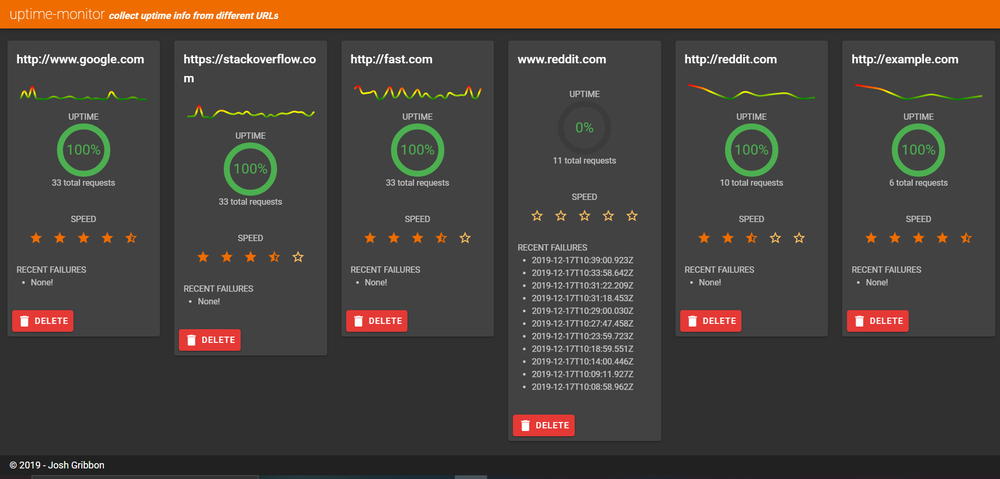

# perf-mon

A simple server for performance monitoring

* Enter URLs to collect PING data from
* Configure monitoring
  * Ping frequency
  * Save response data
* See a cool dashboard

## TODO

* [x] Ping repeatedly and collect response times
* [x] Be able to add/remove routes from the pinger list
* [x] Reset ping interval when refresh rate is changed
* [x] Move history into a DB for persistence
  * [ ] Use a real DB instead of a JSON file?
* [x] Break out into a new repo
* [-] Better frontend UI to display history
  * [x] Add frontend to add/remove routes
  * [x] Display some basic charts for each route
  * [ ] Add a big chart for all routes
  * [ ] Automatically refresh history
  * [x] Try out [Tailwind](https://github.com/tailwindcss/tailwindcss)
  * [x] Replace Vuetify with Tailwind

## Screenshots

**20191217**

